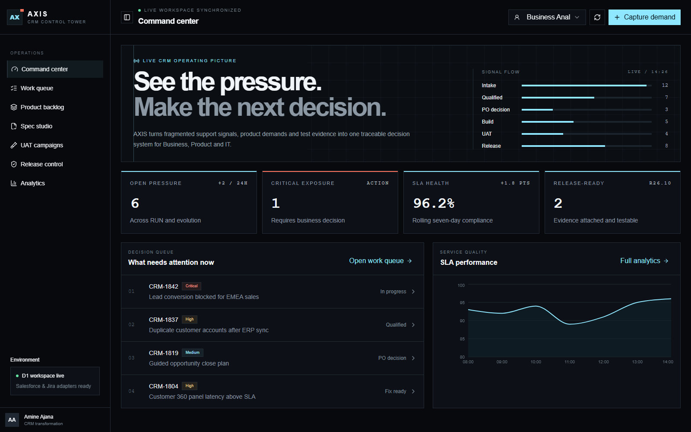

# AXIS — CRM Operations Control Tower

AXIS is a multi-role operating system for CRM RUN and product-evolution teams. It turns incidents, defects, enhancement requests, specifications, UAT evidence and release decisions into one traceable workflow.

It was designed around the day-to-day work of a CRM Business Analyst supporting Product Owners across Business, Support, Development and QA.



## Why AXIS exists

CRM teams often manage operational incidents in one tool, product requests in another, specifications in documents and UAT evidence in spreadsheets. The result is weak traceability and slow decisions.

AXIS creates one operating picture:

`Intake → Qualification → PO decision → Specification → Build → UAT → Release gate`

## Product surfaces

- **Command Center** — live exposure, decision queue, SLA health and delivery flow.
- **Unified Work Queue** — incidents, defects, requests and evolutions with search and filtering.
- **Product Backlog** — priority-scored cards and controlled workflow advancement.
- **Spec Studio** — business impact, user stories, acceptance criteria and definition-quality checks.
- **UAT Campaigns** — execution progress, pass/fail decisions and blocking-defect signals.
- **Release Control** — evidence-based readiness score, blockers and authorization gate.
- **Operational Analytics** — service health, work composition and priority pressure.

## What is functional

- Create and persist CRM work items.
- Update ownership, status, severity and test state.
- Move items through the product lifecycle.
- Record an activity trail for every create and update action.
- Seed a realistic first workspace safely and idempotently.
- Continue in read/write demo mode when the database is unavailable.
- Switch operational viewpoints between Business Analyst, Product Owner, Support Lead and QA Lead.

Salesforce and Jira are deliberately represented as **connector-ready boundaries**, not falsely advertised live integrations.

## Architecture

```text
Next.js / React interface
        │
        ├── Command Center, Queue, Backlog, Spec Studio
        ├── UAT, Release Control, Analytics
        │
Route handlers /api/work-items
        │
Cloudflare D1
        ├── work_items
        ├── activities
        └── release_gates
```

See [the detailed architecture and data model](docs/ARCHITECTURE.md).

## Technology

- TypeScript, React and Next.js-compatible Vinext runtime
- Cloudflare Workers and D1
- Drizzle ORM migrations
- Shadcn UI primitives
- Recharts analytics
- WebMCP read capability

## Run locally

```bash
npm install
npm run db:generate
npm run build
npm start
```

The production-like local server runs at `http://127.0.0.1:8787`.

## Verification

The release candidate has been checked through:

- Production compilation
- D1 schema migration
- Homepage and API HTTP smoke tests
- Work-item creation
- Status update
- Database persistence and activity audit verification

## Product roadmap

- OAuth-backed Salesforce and Jira adapters
- Configurable SLA policies by market and request type
- Import reconciliation and duplicate detection
- Release calendar and dependency graph
- Role-based authorization and approval policies
- Exportable governance and service-quality reports

## Author

**Mohamed Amine Ajana** — Junior CRM Business Analyst / Salesforce Consultant

[GitHub](https://github.com/iconamine) · [LinkedIn](https://www.linkedin.com/in/amine-ajana-3a78a0376/)

## License

MIT — see [LICENSE](LICENSE).
