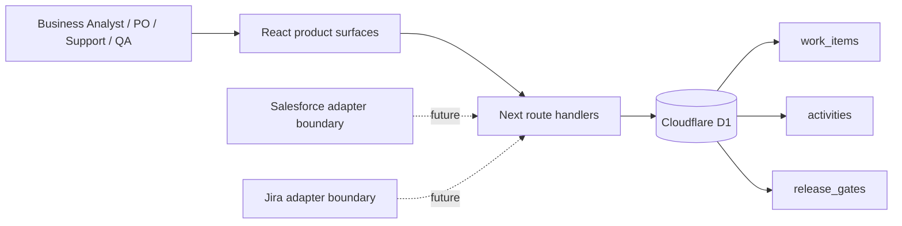

# AXIS architecture

## Design principles

1. **One traceable lifecycle** — every demand keeps the same identifier from intake to release.
2. **Evidence before status** — specifications, acceptance criteria and UAT state are first-class data.
3. **Business and IT share one view** — operational and product work are visible without duplicating records.
4. **Continuity by design** — the interface remains explorable if the persistent layer is temporarily unavailable.
5. **No simulated integration claims** — external platforms are adapter boundaries until credentials and contracts exist.

## Runtime

## Data model

### `work_items`

Stores the operational and functional truth: reference, title, description, type, status, severity, priority score, SLA, owner, source, business impact, user story, acceptance criteria, test state and release.

Indexes support status queues, status/priority ordering and type filters.

### `activities`

Append-only audit events for item creation and field updates, including actor, action, detail and timestamp.

### `release_gates`

Stores named release trains, target date, readiness score, blocker count and gate status.

## API contract

- `GET /api/work-items` — returns work items, recent activity and the active release gate.
- `POST /api/work-items` — creates a demand and its initial audit event.
- `PATCH /api/work-items` — updates an approved field and appends an audit event.

The API uses bound D1 parameters for values and an explicit allow-list for update fields.

## Deployment

The Site build packages the Worker runtime, static assets, hosting manifest and generated D1 migration. Schema changes are performed only through migrations; runtime handlers never create or alter tables.
